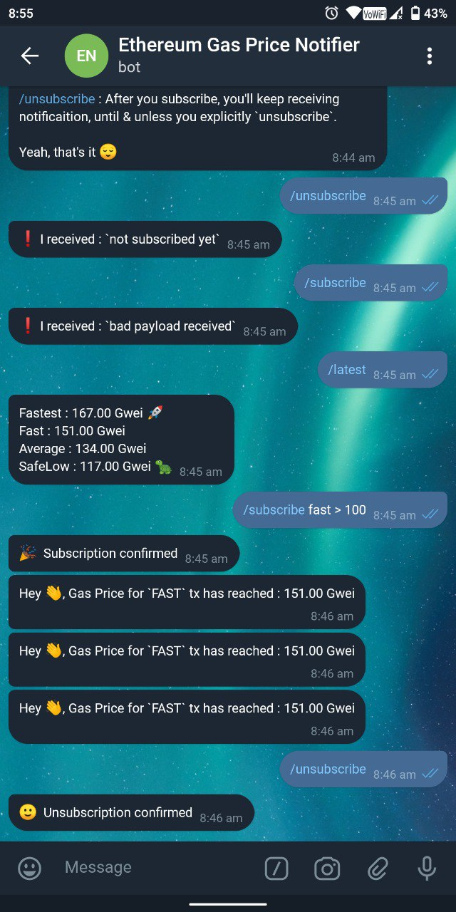

> **Warning**

**I've stopped maintaining this project !**

# gasbot 🤖
Telegram Bot for Ethereum Gas Price Notification [`@EthereumGasPriceNotifier_bot`](https://t.me/EthereumGasPriceNotifier_bot)

## Motivation

Sometime ago I created one service for getting notified about recommended Ethereum Gas Price changes. It's called `gasz : Ethereum Gas Price Notifier`.

~You can use it @ https://gasz.in~

It has Web Notification functionality & how it works is like 👇

- You subscribe to service, over Websocket transport, with a payload, which specifies when recommended Gas Price of certain category i.e. `{fast, fastest, average, safeLow}`, reaches certain threshold, you'll be notified
- And you'll receive one browser notification, when it happens

Also, you can write your own client, which subscribes programmatically & takes decisions. 

Explore more @ https://github.com/itzmeanjan/gasz

But browsers sometimes behave unexpectedly

- Your websocket connection can get dropped for different reasons
- Connection management in `gasz` webUI is done using service workers, to reduce load on service
- It allows me to maintain single connection from single browser & you can subscribe multiple times over same transport
- But it shows some strange behaviour sometimes
- Also there're common cases like, you quiting browser window/ putting your machine into sleep
- In all these cases connection will get hampered & `gasz` doesn't remember who subscribed to what, one connection is lost. So reconnection is not so helpful. You have to subscribe again.

Due to all these problems, I thought of writing one Telegram Bot which will help me in easily notifying you about Ethereum Gas Price changes, when you subscribe to. You can also check what's current recommended gas price.

## Installation

As this project is licensed under very liberal license, you're very welcome to clone this repo & run your own bot.

For running this service,

- Make sure you've Golang _( >= 1.16 )_

- Then clone this repo

```bash
git clone https://github.com/itzmeanjan/gasbot.git
```

- Now you need to create `.env` file in root of this project

```bash
cd gasbot
touch .env
```

- Put 👇 content inside `.env`

```
GASZ_Subscribe=wss://gasz.in/v1/subscribe
Url=https://<domain>
Token=<token>
Port=7000
```

Environment Variable | Interpretation
--- | ---
GASZ_Subscribe | Subscribe to this service for latest recommended gas price, over websocket transport
Url | Publicly accessible URL of this bot service
Token | Your secret token, obtained after registering your bot with `@BotFather`
Port | Run HTTP server on this port, where Telegram will send payload, when someone interacts with this bot

- Now you can start this service

```bash
make run
```

## Running in Production

For running this service in production, I'll use `systemd`.

Here's a unit file for that. This can be put in `/etc/systemd/system/gasbot.service`.

```bash
[Unit]
Description=gasbot - Ethereum Gas Price Notifier Telegram Bot

[Service]
User=ubuntu
WorkingDirectory=/home/ubuntu/gasbot
ExecStart=/home/ubuntu/gasbot/gasbot
Restart=on-failure
RestartSec=10s

[Install]
WantedBy=multi-user.target
```

## Usage


- Find `@EthereumGasPriceNotifier_bot` on Telegram & **start** it
- You should ask for help, by sending `/help`, which gives you one guide on how to interact with this bot properly
- You can ask it for latest recommended Ethereum Gas Price, by sending command `/latest`


- You can subscribe to receive notification when recommended gas price of certain category reaches threshold, by sending command of form

> `/subscribe <txType> <operator> <threshold>`

- txType ∈ {`fastest`, `fast`, `average`, `safeLow`}
- operator ∈ {`<`, `>`, `<=`, `>=`, `==`}
- threshold >= 1.0 ( in Gwei )

For example if you send, 

> `/subscribe fast < 150`

You'll be notified as soon as gas price for `fast` category goes below 150 Gwei.


- After you subscribe, you'll keep receiving notification until & unless you unsubscribe from it. It can be done by sending

> `/unsubscribe`



